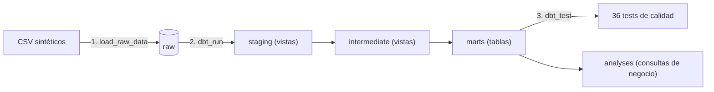
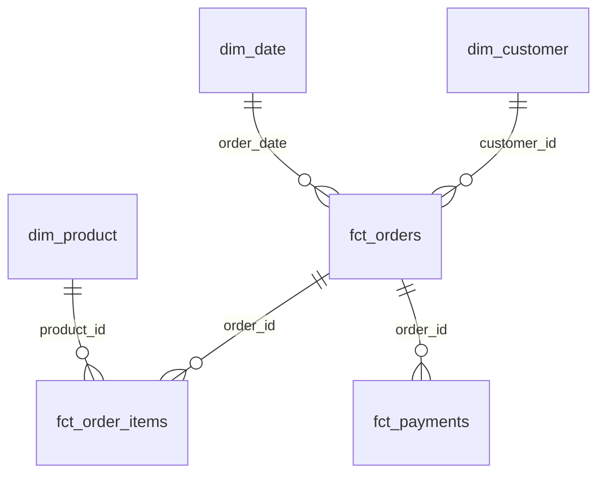

# E-commerce Data Platform


Plataforma de datos de extremo a extremo para un comercio electrónico: ingesta de ficheros CSV a PostgreSQL, transformación en capas con dbt, orquestación con Apache Airflow y verificación automática en cada cambio con GitHub Actions.

El proyecto está pensado para demostrar no solo que el pipeline funciona, sino que **se comporta bien cuando algo falla**: es idempotente, atómico, valida los datos antes de tocar la base de datos y deja trazabilidad de cada carga.

## Qué demuestra este proyecto

- **Ingesta fiable.** Carga idempotente (puedes ejecutarla varias veces sin duplicar datos) y atómica (una única transacción para las cinco tablas), con validación previa y tabla de auditoría.
- **Modelado dimensional con dbt.** Capas `staging → intermediate → marts`, esquema en estrella, esquemas de PostgreSQL separados por capa y 36 tests de calidad de datos.
- **Orquestación con Airflow 3.** DAG con dependencias, reintentos con criterio, timeouts y control de concurrencia.
- **Calidad y CI.** Tests unitarios, test de integridad del DAG, lint y formato con `ruff`, y un trabajo que ejecuta el pipeline completo contra un PostgreSQL temporal.
- **Análisis de negocio versionado.** Consultas SQL sobre los marts, validadas entre sí.

## Arquitectura



| Componente | Tecnología |
|---|---|
| Base de datos | PostgreSQL 16 |
| Orquestación | Apache Airflow 3.0.6 (LocalExecutor) |
| Transformación | dbt-core 1.12.5 con dbt-postgres 1.11.0 |
| Ingesta | Python 3.12 y psycopg 3 |
| Contenedores | Docker Compose |
| Calidad | pytest, ruff, GitHub Actions |

## Estructura del repositorio

```text
.
├── .github/workflows/ci.yml       # CI: lint, tests, test del DAG y pipeline completo
├── dags/
│   └── ecommerce_pipeline.py      # DAG: load_raw_data → dbt_run → dbt_test
├── dbt/ecommerce/
│   ├── models/
│   │   ├── staging/               # stg_* (vistas) y definición de sources
│   │   ├── intermediate/          # int_order_items_enriched (vista)
│   │   └── marts/                 # dim_* y fct_* (tablas) con sus tests
│   ├── analyses/                  # consultas de negocio (con ref())
│   ├── tests/                     # tests singulares de coherencia
│   ├── macros/generate_schema_name.sql
│   ├── dbt_project.yml
│   └── profiles.yml               # lee la conexión de variables de entorno
├── sql/initialization/            # esquema raw, tabla de auditoría
├── src/ingestion/
│   ├── generate_raw_data.py       # genera los CSV sintéticos
│   └── load_raw_data.py           # carga validada y transaccional
├── tests/                         # pytest: loader e integridad del DAG
├── docker-compose.yml
├── Dockerfile
├── requirements.txt
└── ruff.toml
```

## Modelo de datos

Los modelos se crean en esquemas de PostgreSQL separados, uno por capa, gracias a una macro `generate_schema_name` que evita el prefijo por defecto de dbt.

| Esquema | Contenido | Materialización |
|---|---|---|
| `raw` | Datos tal como llegan, más `raw._load_audit` y la columna `_loaded_at` | Tablas |
| `staging` | `stg_customers`, `stg_products`, `stg_orders`, `stg_order_items`, `stg_payments` | Vistas |
| `intermediate` | `int_order_items_enriched` | Vista |
| `marts` | `dim_customer`, `dim_product`, `dim_date`, `fct_orders`, `fct_order_items`, `fct_payments` | Tablas |



## Cómo ejecutarlo

Requisitos: Docker con Docker Compose.

1. **Clonar y configurar.**

   ```powershell
   git clone https://github.com/rugarce/ecommerce-data-platform.git
   cd ecommerce-data-platform
   Copy-Item .env.example .env
   ```

   Edita `.env` y rellena las variables: `POSTGRES_USER`, `POSTGRES_PASSWORD`, `POSTGRES_DB`, `POSTGRES_PORT`, `AIRFLOW_PORT`, `AIRFLOW__API_AUTH__JWT_SECRET` y `AIRFLOW__CORE__INTERNAL_API_SECRET_KEY`. Para generar los dos secretos:

   ```powershell
   python -c "import secrets; print(secrets.token_urlsafe(32))"
   ```

2. **Levantar los servicios.**

   ```powershell
   docker compose up -d --build
   ```

   Los scripts de `sql/initialization` crean el esquema `raw` y la tabla de auditoría la primera vez, con el volumen de PostgreSQL vacío.

3. **Generar los datos de ejemplo.** Los CSV no se versionan; se generan de forma determinista:

   ```powershell
   docker exec ecommerce_airflow_scheduler python /opt/airflow/src/ingestion/generate_raw_data.py
   ```

4. **Ejecutar el pipeline.** Desde la interfaz de Airflow (`http://localhost:8080`, usuario `admin`; la contraseña se genera en el primer arranque y aparece con `docker compose logs airflow-webserver`), lanzando el DAG `ecommerce_pipeline`. O desde la línea de comandos:

   ```powershell
   docker exec ecommerce_airflow_scheduler airflow dags test ecommerce_pipeline AAAA-MM-DD
   ```

5. **Consultar los resultados.**

   ```powershell
   docker exec ecommerce_postgres psql -U <POSTGRES_USER> -d <POSTGRES_DB> -c "SELECT COUNT(*) FROM marts.fct_orders;"
   docker exec ecommerce_airflow_scheduler bash -c "cd /opt/airflow/dbt/ecommerce && dbt show --select ingresos_mensuales --limit 50 --profiles-dir ."
   ```

## Fiabilidad: qué pasa cuando algo falla

| Situación | Comportamiento |
|---|---|
| Se ejecuta la carga varias veces | Mismo resultado: `TRUNCATE` + `INSERT` dentro de la misma transacción |
| Falla la carga de una tabla | Rollback de las cinco tablas: nunca queda un estado a medias |
| CSV vacío, solo con cabecera, sin columnas o con líneas incompletas | La validación falla **antes de abrir la conexión**; la base de datos no se toca |
| Falla `load_raw_data` | Tres intentos (la carga es idempotente) y, si persiste, el DAG queda en `failed` con `dbt_run` y `dbt_test` sin ejecutar |
| Falla dbt | Sin reintentos: sus errores son deterministas y se quieren ver a la primera |
| Dos ejecuciones a la vez | `max_active_runs=1`: la segunda espera en cola |
| ¿Qué se cargó y cuándo? | `raw._load_audit` registra ejecución, tabla y filas; `_loaded_at` marca cada fila |

Estas garantías no son solo declaraciones: se comprobaron provocando fallos controlados, y los tests del loader y del DAG las protegen en cada cambio.

## Calidad y CI

Cada push y cada pull request ejecutan en GitHub Actions:

| Trabajo | Qué comprueba |
|---|---|
| `lint` | `ruff check` y `ruff format --check` |
| `unit-tests` | Tests del loader con pytest (CSV válido, inexistente, columnas ausentes, solo cabecera, línea incompleta y que no se abre conexión si falla la validación) |
| `dag-tests` | Con Airflow 3.0.6 instalado: sin errores de importación, orden de tareas, reintentos, timeouts, callbacks, `max_active_runs` y `catchup` |
| `pipeline` | Con un PostgreSQL temporal: crea el esquema raw, genera los datos, los carga, ejecuta `dbt build` (modelos y tests), compila los análisis y verifica los recuentos de los marts |

`pipeline` solo se ejecuta si `lint` y `unit-tests` pasan.

Para ejecutar los tests en local (entorno virtual de Python):

```powershell
pip install -r requirements.txt
ruff check .
ruff format --check .
python -m pytest tests -v
```

El test del DAG se salta en Windows porque Airflow no se instala allí; se ejecuta en CI. Para lanzarlo en local con la imagen del proyecto:

```powershell
docker run --rm -v "${PWD}:/proj" -w /proj ecommerce_airflow_custom:3.0.6 bash -c "pip install -q pytest && python -m pytest tests/test_dag_integrity.py -v -p no:cacheprovider"
```

## Análisis de negocio

Las consultas viven en `dbt/ecommerce/analyses/` y usan `ref()`, así que dbt las compila y el CI detecta si un cambio en los modelos las rompe. Ingresos = suma de los pedidos con estado `completed`.

| Análisis | Pregunta |
|---|---|
| `ingresos_mensuales` | ¿Cuánto se factura al mes y cómo evoluciona? |
| `ventas_por_dia_semana` | ¿Qué días se vende más? |
| `clientes_por_pais` | ¿Cómo se reparten clientes e ingresos por país? |
| `top_clientes` | ¿Quiénes son los 10 mejores clientes y cuánto pesan? |
| `ingresos_por_producto` | ¿Qué productos generan más ingresos? |
| `ingresos_por_categoria` | ¿Qué categorías pesan más? |
| `pedidos_por_estado` | ¿Qué proporción de pedidos se completa, queda pendiente o se cancela? |
| `pagos_por_metodo` | ¿Cuánto se cobra por método y qué porcentaje se completa? |
| `conciliacion_pedidos_pagos` | Control de calidad: pedidos y pagos incoherentes (esperado: 0 filas) |

**Validación cruzada.** Los ingresos totales de pedidos completados son **13.365,16**, y esa misma cifra se obtiene por seis caminos independientes: por mes, por país, por producto, por categoría, por estado del pedido y a través de los pagos completados. Que coincidan es la mejor prueba de que los modelos y las consultas son coherentes entre sí.

Una cautela al interpretar `ingresos_por_categoria`: `completed_orders` cuenta pedidos distintos por categoría y no se puede sumar, porque un pedido puede incluir productos de varias categorías.

## Decisiones de diseño

- **Truncate y carga en una sola transacción**, en lugar de upsert: para este volumen es lo más simple y da idempotencia y atomicidad a la vez.
- **Validar antes de conectar.** Los CSV se leen y comprueban por completo antes de abrir la conexión, de modo que un fichero defectuoso no puede dejar vacía una tabla.
- **Reintentos solo donde son seguros.** La carga es idempotente y se reintenta; dbt falla de forma determinista y no.
- **Esquemas por capa.** Facilitan los permisos y dejan claro qué es público (`marts`) y qué es detalle interno.
- **`analyses` de dbt en lugar de SQL suelto.** Las consultas usan `ref()` y se compilan en CI.
- **Tests de coherencia además de los genéricos.** Por ejemplo, que el importe de cada línea sea cantidad por precio y que las líneas sumen el total del pedido.
- **`profiles.yml` versionado y sin secretos**: lee la conexión de variables de entorno, lo que permite usar el mismo archivo en local, en Docker y en CI.

## Limitaciones conocidas

- **Datos sintéticos y deterministas.** El generador no usa aleatoriedad real: el país del cliente y el estado del pedido avanzan en ciclos alineados. Por eso algunos patrones (por ejemplo, que Alemania e Italia no tengan pedidos completados) son artefactos del generador y no conclusiones de negocio. Con solo 30 pedidos, los análisis son ilustrativos.
- **`dbt_test` se ejecuta después de `dbt_run`.** Si un test falla, el DAG se marca como fallido pero los modelos ya están publicados en `marts`.
- **Carga completa (full refresh).** `TRUNCATE` bloquea las lecturas de las tablas raw mientras dura la carga y no sirve para cargas incrementales a gran escala.
- **Credenciales de desarrollo.** Los valores por defecto del loader y de `profiles.yml` son solo para uso local; en cualquier otro entorno deben proporcionarse por variables de entorno.
- **Ejecución manual.** El DAG no tiene `schedule`; se lanza a mano.

## Posibles mejoras

- Modelos incrementales y snapshots (historial de cambios en dimensiones).
- Control de frescura de datos con `source freshness` apoyándose en `_loaded_at`.
- Construir en un esquema temporal y promover a `marts` solo si pasan los tests.
- Panel de BI (por ejemplo, Metabase) con un usuario de solo lectura sobre `marts`.
- Planificar el DAG (`@daily`) y generar datos con aleatoriedad reproducible.